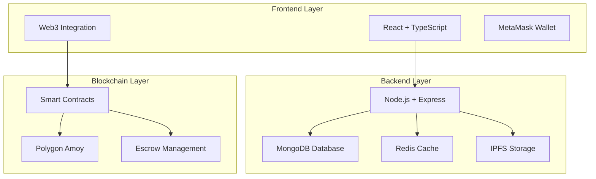

# SmartPay - Decentralized Freelance Work Platform

<div align="center">

[](https://opensource.org/licenses/MIT)
[](https://nodejs.org/)
[](https://reactjs.org/)
[](https://www.typescriptlang.org/)
[](https://soliditylang.org/)
[](https://polygon.technology/)

**Enterprise-grade decentralized freelance platform with automated milestone-based payments using blockchain smart contracts**

[🚀 Live Demo](#demo) • [📖 Documentation](#documentation) • [🏗️ Architecture](#architecture) • [🔧 Quick Start](#quick-start) • [📊 Features](#features)

</div>

---

## 🌟 Overview

**SmartPay** is a revolutionary decentralized freelance work platform that automates milestone-based payments using blockchain smart contracts. Built during a 48-hour hackathon, it provides a trustless, transparent, and secure environment for both clients and freelancers to collaborate with confidence.

### � Key Achievements

- **🔗 Full-Stack Web3 Integration**: Complete three-layer architecture with React frontend, Node.js backend, and Solidity smart contracts
- **💼 Dual Role System**: Separate optimized dashboards for clients and freelancers
- **📊 Automated Escrow**: Smart contract-powered milestone management with automatic payment release
- **🔒 Security First**: Multi-signature support, dispute resolution, and comprehensive audit logging
- **⚡ Real-time Features**: WebSocket-powered notifications and live project updates
- **🌐 Decentralized Storage**: IPFS integration for secure file storage and deliverables

---

## 🏗️ System Architecture



### 📁 Project Structure

```
SmartPay/
├── 🎨 frontend/              # React frontend application
│   ├── client/               # Main React app
│   │   ├── src/
│   │   │   ├── components/   # Reusable UI components
│   │   │   ├── pages/        # Application pages/routes
│   │   │   ├── contexts/     # React contexts (Web3, Auth)
│   │   │   ├── hooks/        # Custom React hooks
│   │   │   └── lib/          # Utilities and configurations
│   ├── server/               # Frontend server
│   └── shared/               # Shared schemas and types
├── �️ server/                # Express.js backend
│   ├── src/
│   │   ├── controllers/      # API route handlers
│   │   ├── models/           # Database models
│   │   ├── routes/           # API endpoints
│   │   ├── services/         # Business logic services
│   │   ├── middleware/       # Authentication & validation
│   │   ├── config/           # Configuration files
│   │   └── utils/            # Helper functions
├── ⛓️ backend/SmartContract/  # Blockchain smart contracts
│   ├── contracts/            # Solidity smart contracts
│   ├── test/                 # Contract tests
│   ├── scripts/              # Deployment scripts
│   └── ignition/             # Hardhat deployment modules
└── 📚 docs/                  # Documentation
```

---

## 📊 Features

### 🔐 **Core Platform Features**

| Feature | Description | Status |
|---------|-------------|---------|
| **Smart Escrow** | Automated milestone-based payment system | ✅ Implemented |
| **Dual Dashboards** | Separate interfaces for clients and freelancers | ✅ Implemented |
| **Web3 Integration** | MetaMask wallet connection and blockchain interaction | ✅ Implemented |
| **Real-time Updates** | WebSocket-powered live notifications | ✅ Implemented |
| **Dispute Resolution** | On-chain arbitration system | ✅ Implemented |
| **IPFS Storage** | Decentralized file storage for deliverables | ✅ Implemented |

### 🎨 **Frontend Features**

- **Modern UI/UX**: Responsive design with Tailwind CSS and Framer Motion animations
- **TypeScript Safety**: Full type safety with strict TypeScript configuration
- **Component Library**: Custom UI components built on Radix UI primitives
- **Form Management**: React Hook Form with Zod validation
- **State Management**: TanStack React Query for server state
- **Routing**: Lightweight Wouter router for navigation

### 🖥️ **Backend Features**

- **150+ API Endpoints**: Comprehensive REST API across 25+ core services
- **Enterprise Architecture**: Singleton patterns and service management
- **Security**: JWT authentication, rate limiting, and RBAC
- **Blockchain Integration**: Full Ethereum smart contract interaction
- **Data Management**: MongoDB with Redis caching
- **Real-time Communication**: WebSocket support for live updates

### ⛓️ **Smart Contract Features**

- **AutomatedMilestoneEscrow**: Main contract with Chainlink automation
- **MilestoneEscrow**: Basic escrow functionality
- **SmartPay**: General payment processing
- **MyToken**: ERC-20 token for platform payments
- **Security**: Comprehensive testing and gas optimization

---

## 🚀 Quick Start

### Prerequisites

Ensure you have the following installed:
- **Node.js** (v18 or higher) - [Download here](https://nodejs.org/)
- **npm** or **yarn** package manager
- **Git** - [Download here](https://git-scm.com/)
- **MetaMask** browser extension for Web3 functionality
- **MongoDB** (v5.0+) for database
- **Redis** (v6.0+) for caching (optional)

### 1. Clone the Repository

```bash
# Clone the project
git clone https://github.com/FireFistisDead/SmartPay.git

# Navigate to project directory
cd SmartPay
```

### 2. Environment Setup

Create environment files for each component:

#### Frontend Environment
```bash
# frontend/.env
VITE_API_URL=http://localhost:3000
VITE_FIREBASE_API_KEY=your_firebase_api_key
VITE_FIREBASE_AUTH_DOMAIN=your_project.firebaseapp.com
VITE_FIREBASE_PROJECT_ID=your_project_id
```

#### Backend Environment
```bash
# server/.env
NODE_ENV=development
PORT=3000
MONGODB_URI=mongodb://localhost:27017/smartpay
REDIS_URL=redis://localhost:6379
JWT_SECRET=your_jwt_secret_key
FIREBASE_PROJECT_ID=your_firebase_project_id
BLOCKCHAIN_NETWORK=polygon-amoy
RPC_URL_POLYGON_AMOY=https://rpc-amoy.polygon.technology
PRIVATE_KEY=your_wallet_private_key
```

#### Smart Contract Environment
```bash
# backend/SmartContract/.env
PRIVATE_KEY=your_private_key_here
AMOY_RPC_URL=https://rpc-amoy.polygon.technology
PLATFORM_WALLET=your_platform_wallet_address
POLYGONSCAN_API_KEY=your_polygonscan_api_key
```

### 3. Installation & Setup

#### Install Dependencies
```bash
# Install all dependencies
npm install

# Install frontend dependencies
cd frontend && npm install

# Install backend dependencies
cd ../server && npm install

# Install smart contract dependencies
cd ../backend/SmartContract && npm install
```

#### Database Setup
```bash
# Start MongoDB (if running locally)
mongod

# Start Redis (if running locally)
redis-server
```

### 4. Smart Contract Deployment

```bash
# Navigate to smart contract directory
cd backend/SmartContract

# Compile contracts
npm run compile

# Run tests
npm run test

# Deploy to Polygon Amoy testnet
npm run deploy:amoy

# Verify contracts (optional)
npm run verify:amoy
```

### 5. Start the Application

Open three terminal windows:

#### Terminal 1: Backend Server
```bash
cd server
npm run dev
# Server will start on http://localhost:3000
```

#### Terminal 2: Frontend Development
```bash
cd frontend
npm run dev
# Frontend will start on http://localhost:5173
```

#### Terminal 3: Smart Contract Development (Optional)
```bash
cd backend/SmartContract
npx hardhat node  # For local blockchain testing
```

### 6. Access the Application

- **Frontend**: [http://localhost:5173](http://localhost:5173)
- **Backend API**: [http://localhost:3000](http://localhost:3000)
- **API Documentation**: [http://localhost:3000/api-docs](http://localhost:3000/api-docs)

---

## 🧪 Technology Stack

### 🎨 **Frontend Technologies**

| Technology | Version | Purpose |
|------------|---------|---------|
| **React** | 18.3.1 | UI framework with hooks and functional components |
| **TypeScript** | 5.6.3 | Type-safe JavaScript development |
| **Vite** | 5.4.19 | Fast build tool and development server |
| **Tailwind CSS** | 3.4.17 | Utility-first CSS framework |
| **Framer Motion** | 11.18.2 | Animation library for smooth interactions |
| **Radix UI** | Latest | Unstyled, accessible UI primitives |
| **React Hook Form** | 7.55.0 | Form handling and validation |
| **TanStack Query** | 5.60.5 | Server state management |
| **Wouter** | 3.3.5 | Lightweight React router |
| **ethers.js** | 6.15.0 | Ethereum blockchain interaction |
| **Zod** | 3.24.2 | TypeScript-first schema validation |

### 🖥️ **Backend Technologies**

| Technology | Version | Purpose |
|------------|---------|---------|
| **Node.js** | 18+ | JavaScript runtime environment |
| **Express.js** | 4.21.1 | Web application framework |
| **MongoDB** | 5.0+ | NoSQL database for data persistence |
| **Redis** | 6.0+ | In-memory caching and session storage |
| **ethers.js** | 6.15.0 | Blockchain integration library |
| **Firebase Admin** | Latest | Authentication and user management |
| **Socket.io** | 4.8.1 | Real-time bidirectional communication |
| **Multer** | 1.4.5 | File upload middleware |
| **Helmet** | 8.0.0 | Security middleware for Express |
| **Rate Limiter** | Latest | API rate limiting and DDoS protection |

### ⛓️ **Blockchain Technologies**

| Technology | Version | Purpose |
|------------|---------|---------|
| **Solidity** | 0.8.28 | Smart contract programming language |
| **Hardhat** | 2.26.3 | Ethereum development framework |
| **Polygon** | Amoy Testnet | Layer 2 scaling solution for Ethereum |
| **Chainlink** | Latest | Decentralized oracle network for automation |
| **IPFS** | Latest | Decentralized file storage protocol |
| **OpenZeppelin** | 5.1.0 | Secure smart contract library |

### 🛠️ **Development Tools**

| Tool | Purpose |
|------|---------|
| **ESLint** | Code linting and quality assurance |
| **Prettier** | Code formatting and style consistency |
| **TypeChain** | TypeScript bindings for smart contracts |
| **Jest** | Testing framework for JavaScript/TypeScript |
| **Hardhat Gas Reporter** | Gas optimization analysis |
| **Solidity Coverage** | Smart contract test coverage |

---

## 🌐 User Roles & Features

### 👔 **Client Features**

- **Project Creation**: Create detailed project listings with milestones
- **Freelancer Management**: Browse, hire, and manage freelancer applications
- **Milestone Tracking**: Monitor project progress and approve deliverables
- **Payment Control**: Secure escrow management with automated releases
- **Dispute Resolution**: Raise disputes for quality or delivery issues
- **Analytics Dashboard**: Track spending, project success rates, and performance

### 👨‍💻 **Freelancer Features**

- **Job Discovery**: Browse and filter available projects by skills and budget
- **Application System**: Submit proposals with custom pricing and timelines
- **Work Management**: Track active projects and milestone deadlines
- **Deliverable Submission**: Upload work files and request milestone approval
- **Earnings Tracking**: Monitor income, pending payments, and payment history
- **Reputation System**: Build credibility through successful project completions

### 🔧 **Platform Features**

- **Smart Escrow**: Automated fund management with milestone-based releases
- **Dispute Resolution**: Fair arbitration system with oracle integration
- **File Storage**: IPFS-powered decentralized storage for project files
- **Real-time Updates**: Instant notifications for all platform activities
- **Security**: Multi-layer security with wallet authentication and encryption
- **Analytics**: Comprehensive reporting and insights for all users

---

## 🔧 Development

### 📝 **Available Scripts**

#### Frontend Scripts
```bash
npm run dev          # Start development server with hot reload
npm run build        # Build production version
npm run start        # Start production server
npm run check        # Run TypeScript type checking
npm run lint         # Lint code for errors and style issues
npm run db:push      # Push database schema changes
```

#### Backend Scripts
```bash
npm start            # Start production server
npm run dev          # Start development server with auto-reload
npm test             # Run test suite
npm run test:watch   # Run tests in watch mode
npm run test:coverage # Generate test coverage report
npm run lint         # Lint backend code
npm run lint:fix     # Auto-fix linting issues
```

#### Smart Contract Scripts
```bash
npm run compile      # Compile smart contracts
npm run test         # Run contract tests
npm run test:coverage # Generate test coverage
npm run deploy:local # Deploy to local Hardhat network
npm run deploy:amoy  # Deploy to Polygon Amoy testnet
npm run verify:amoy  # Verify contracts on Polygonscan
npm run clean        # Clean compiled artifacts
```

### 🧪 **Testing**

#### Frontend Testing
```bash
cd frontend
npm test             # Run React component tests
npm run test:coverage # Generate frontend test coverage
```

#### Backend Testing
```bash
cd server
npm test             # Run API integration tests
npm run test:structure # Test application structure
npm run test:phases # Test different development phases
npm run test:all    # Run comprehensive test suite
```

#### Smart Contract Testing
```bash
cd backend/SmartContract
npm test             # Run Solidity contract tests
npm run test:coverage # Generate contract test coverage
npx hardhat test --gas-reporter # Test with gas optimization report
```

### � **Performance Optimization**

- **Frontend**: Vite build optimization, code splitting, lazy loading
- **Backend**: Redis caching, connection pooling, query optimization
- **Smart Contracts**: Gas optimization, batch operations, efficient data structures

---

## 🔒 Security Features

### 🛡️ **Application Security**

- **Authentication**: Firebase Auth with wallet signature verification
- **Authorization**: Role-based access control (RBAC) system
- **Rate Limiting**: API request throttling and DDoS protection
- **Input Validation**: Comprehensive data sanitization and validation
- **Security Headers**: Helmet.js for secure HTTP headers
- **Session Management**: Secure session handling with Redis

### ⛓️ **Blockchain Security**

- **Smart Contract Auditing**: Comprehensive test coverage and security analysis
- **Multi-signature Support**: Enhanced security for high-value transactions
- **Escrow Protection**: Funds locked in smart contracts until milestone completion
- **Dispute Resolution**: Fair arbitration system with oracle integration
- **Gas Optimization**: Efficient contract design to minimize transaction costs
- **Upgrade Patterns**: Secure contract upgrade mechanisms

### 🔐 **Data Security**

- **Encryption**: End-to-end encryption for sensitive data
- **IPFS Storage**: Decentralized file storage with content addressing
- **Private Key Management**: Secure wallet integration without key exposure
- **Audit Logging**: Comprehensive activity tracking for compliance
- **Backup Systems**: Regular database backups and disaster recovery

---

## 📈 Analytics & Monitoring

### 📊 **Platform Analytics**

- **User Metrics**: Registration rates, active users, retention analysis
- **Project Metrics**: Success rates, completion times, average project values
- **Payment Analytics**: Transaction volumes, escrow utilization, dispute rates
- **Performance Monitoring**: API response times, error rates, system health

### 🔍 **Business Intelligence**

- **Revenue Tracking**: Platform fees, transaction volumes, growth metrics
- **User Behavior**: Interaction patterns, feature usage, conversion funnels
- **Market Analysis**: Category trends, skill demand, pricing insights
- **Predictive Analytics**: AI-powered recommendations and forecasting

---

## 🚀 Deployment

### 🌐 **Production Deployment**

#### Frontend Deployment
```bash
# Build production frontend
cd frontend
npm run build

# Deploy to hosting service (Vercel, Netlify, etc.)
# Build output will be in dist/ directory
```

#### Backend Deployment
```bash
# Build production backend
cd server
npm run build

# Deploy to cloud service (AWS, Google Cloud, etc.)
# Ensure environment variables are properly configured
```

#### Smart Contract Deployment
```bash
# Deploy to mainnet (Polygon)
cd backend/SmartContract
npm run deploy:polygon

# Verify contracts on Polygonscan
npm run verify:polygon
```

### 🐳 **Docker Deployment**

```bash
# Build and run with Docker Compose
docker-compose up -d

# Scale services
docker-compose up -d --scale backend=3

# Monitor logs
docker-compose logs -f
```

### ☁️ **Cloud Infrastructure**

- **Frontend**: Deployed on Vercel/Netlify with CDN
- **Backend**: Containerized deployment on AWS ECS/Google Cloud Run
- **Database**: MongoDB Atlas or AWS DocumentDB
- **Caching**: Redis Cloud or AWS ElastiCache
- **Storage**: IPFS pinning services (Pinata, Web3.Storage)

---

## 🔮 Future Roadmap

### 📅 **Phase 1: Core Enhancements** (Q1 2025)
- [ ] **Mobile Application**: React Native app for iOS and Android
- [ ] **Advanced Analytics**: Enhanced reporting and business intelligence
- [ ] **Multi-language Support**: Internationalization for global users
- [ ] **Payment Options**: Support for multiple cryptocurrencies
- [ ] **API v2**: GraphQL API for improved data fetching

### 📅 **Phase 2: Advanced Features** (Q2 2025)
- [ ] **AI Integration**: Smart matching between clients and freelancers
- [ ] **Reputation System**: Advanced scoring and verification mechanisms
- [ ] **Team Collaboration**: Multi-freelancer project support
- [ ] **Advanced Escrow**: Complex milestone structures and conditions
- [ ] **Legal Integration**: Contract templates and legal compliance

### 📅 **Phase 3: Ecosystem Expansion** (Q3 2025)
- [ ] **NFT Integration**: Digital certificates for completed work
- [ ] **DAO Governance**: Community-driven platform governance
- [ ] **Cross-chain Support**: Multi-blockchain compatibility
- [ ] **DeFi Integration**: Yield farming and staking features
- [ ] **Marketplace**: Template and service marketplace

---

## 🤝 Contributing

We welcome contributions from the community! Please see our [Contributing Guide](CONTRIBUTING.md) for details.

### 📋 **Development Guidelines**

1. **Fork** the repository
2. **Create** a feature branch (`git checkout -b feature/AmazingFeature`)
3. **Commit** your changes (`git commit -m 'Add some AmazingFeature'`)
4. **Push** to the branch (`git push origin feature/AmazingFeature`)
5. **Open** a Pull Request

### 🐛 **Bug Reports**

Please use the [GitHub Issues](https://github.com/FireFistisDead/SmartPay/issues) to report bugs or request features.

---

## 📄 License

This project is licensed under the MIT License - see the [LICENSE](LICENSE) file for details.

---

## 📞 Support & Contact

- **GitHub**: [FireFistisDead/SmartPay](https://github.com/FireFistisDead/SmartPay)
- **Issues**: [Report a Bug](https://github.com/FireFistisDead/SmartPay/issues)
- **Discussions**: [Community Forum](https://github.com/FireFistisDead/SmartPay/discussions)

---

## 🙏 Acknowledgments

- **Hackathon Team**: Built during a 48-hour development sprint
- **Open Source Community**: Various libraries and tools that made this possible
- **Blockchain Ecosystem**: Polygon, Chainlink, and IPFS for infrastructure
- **UI/UX Libraries**: Radix UI, Tailwind CSS, and Framer Motion

---

<div align="center">

**⭐ Star this repository if you find it helpful!**

Made with ❤️ by the SmartPay Team

</div>

# Navigate to project directory
cd SmartPay

# Switch to your development branch (replace 'YourName' with your actual branch)
git checkout YourName
```

### 2. Install Dependencies

```bash
# Install all dependencies
npm install

# Or using yarn
yarn install
```

### 3. Environment Setup

Create a `.env` file in the root directory:

```env
# Database Configuration
DATABASE_URL="your_database_connection_string"

# Blockchain Configuration  
ETHEREUM_RPC_URL="https://sepolia.infura.io/v3/your-api-key"
PRIVATE_KEY="your_wallet_private_key_for_deployment"

# Session Configuration
SESSION_SECRET="your_session_secret_key"

# Development
NODE_ENV="development"
PORT=3000
```

### 4. Database Setup

```bash
# Push database schema (using Drizzle ORM)
npm run db:push
```

### 5. Start Development Server

```bash
# Start the development server
npm run dev
```

The application will be available at `http://localhost:3000`

## 📝 Available Scripts

| Command | Description |
|---------|-------------|
| `npm run dev` | Start development server with hot reload |
| `npm run build` | Build production version |
| `npm run start` | Start production server |
| `npm run check` | Run TypeScript type checking |
| `npm run db:push` | Push database schema changes |

## 🧪 Technology Stack

### Frontend
- **React 18.3.1** - UI library
- **TypeScript** - Type safety
- **Vite** - Build tool and dev server
- **Tailwind CSS** - Utility-first CSS framework
- **Framer Motion** - Animation library
- **Radix UI** - Accessible component primitives
- **React Hook Form** - Form management
- **Wouter** - Lightweight routing

### Backend
- **Node.js** - Runtime environment
- **Express.js** - Web framework
- **TypeScript** - Type safety
- **Drizzle ORM** - Database ORM
- **Passport.js** - Authentication
- **WebSocket** - Real-time communication

### Blockchain
- **Ethereum/Polygon** - Smart contract deployment
- **Solidity** - Smart contract language
- **ethers.js** - Blockchain interaction
- **IPFS** - Decentralized file storage

### Development Tools
- **ESBuild** - Fast bundler
- **Drizzle Kit** - Database migration tool
- **Cross-env** - Environment variables

## 🌐 User Roles & Features

### 👨‍💼 Client (Employer)
- Create and manage projects
- Define milestone-based payments
- Fund escrow smart contracts
- Approve/reject milestone deliverables
- Manage dispute resolution

### 👩‍💻 Freelancer (Worker)
- Browse available projects
- Submit proposals and accept contracts
- Upload milestone deliverables
- Track payment status
- Participate in dispute resolution

## 🔄 Development Workflow

### Branch Structure
- `main` - Production branch
- `Ansh` - Ansh's development branch
- `Devansh` - Devansh's development branch  
- `Harsh` - Harsh's development branch
- `Vedant` - Vedant's development branch
- `Yash` - Yash's development branch

### Working on Features

1. **Switch to your branch:**
   ```bash
   git checkout YourName
   ```

2. **Pull latest changes:**
   ```bash
   git pull origin YourName
   ```

3. **Make your changes and commit:**
   ```bash
   git add .
   git commit -m "feat: your feature description"
   ```

4. **Push to your branch:**
   ```bash
   git push origin YourName
   ```

### Commit Message Convention
- `feat:` - New feature
- `fix:` - Bug fix
- `docs:` - Documentation changes
- `style:` - Code style changes
- `refactor:` - Code refactoring
- `test:` - Adding tests
- `chore:` - Maintenance tasks

## 🎨 UI Components

The project uses a comprehensive design system built with:

- **Shadcn/ui** components for consistent styling
- **Radix UI** primitives for accessibility
- **Tailwind CSS** for responsive design
- **Framer Motion** for smooth animations
- **Lucide React** for modern icons

### Key Components
- Navigation with wallet connection
- Project cards with hover animations
- Milestone progress tracking
- Payment status indicators
- Dispute resolution interface

## 🔐 Security Features

- **Smart Contract Escrow** - Funds locked until milestone approval
- **Dispute Resolution** - Oracle-based conflict resolution
- **Wallet Authentication** - Secure Web3 login
- **Input Validation** - Zod schema validation
- **Session Management** - Secure session handling

## 📱 Responsive Design

- **Mobile-first** approach
- **Adaptive layouts** for all screen sizes
- **Touch-friendly** interactions
- **Progressive enhancement** for better performance

## 🤝 Contributing

1. **Choose your branch** based on your name
2. **Follow the coding standards:**
   - Use TypeScript for type safety
   - Follow the existing component structure
   - Write descriptive commit messages
   - Test your changes thoroughly

3. **Code Style:**
   - Use Prettier for formatting
   - Follow React best practices
   - Use meaningful variable names
   - Comment complex logic

## 🐛 Troubleshooting

### Common Issues

**Node modules issues:**
```bash
# Delete node_modules and reinstall
rm -rf node_modules package-lock.json
npm install
```

**TypeScript errors:**
```bash
# Run type checking
npm run check
```

**Database connection issues:**
```bash
# Check your DATABASE_URL in .env
# Run database push again
npm run db:push
```

**Port already in use:**
```bash
# Kill process on port 3000
npx kill-port 3000
```

## 📞 Support

- **GitHub Issues**: [Create an issue](https://github.com/FireFistisDead/SmartPay/issues)
- **Team Communication**: Use your preferred team chat platform
- **Documentation**: Check the `/docs` folder for detailed guides

## 📄 License

This project is licensed under the MIT License - see the [LICENSE](LICENSE) file for details.

---

**Happy Coding! 🚀**

Built with ❤️ by the SmartPay team
## Live Website
https://smartpay-v1-0.onrender.com/
