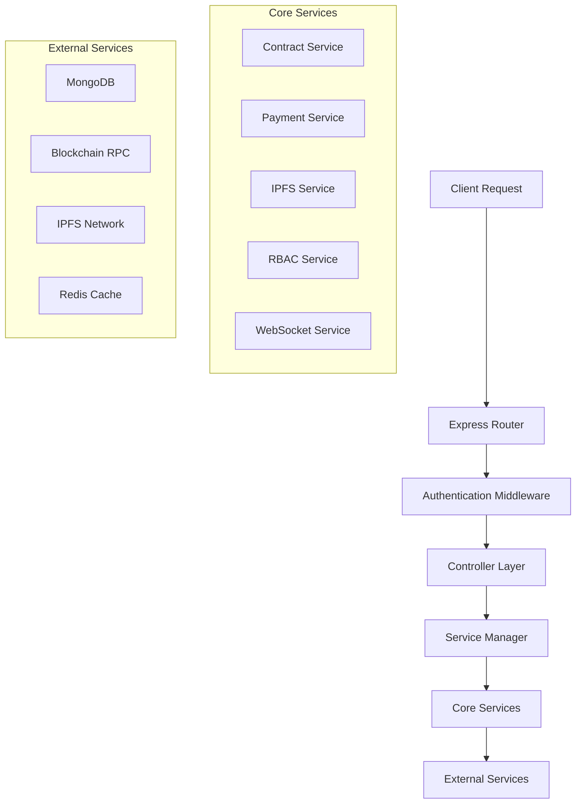

# SmartPay Backend Server

<div align="center">


**Enterprise-grade decentralized freelance escrow platform backend**

[🚀 Quick Start](#quick-start) • [📖 Documentation](#api-documentation) • [🏗️ Architecture](#architecture) • [🔧 Development](#development)

</div>

---

## 📖 Overview

SmartPay Backend is a comprehensive Node.js server powering a decentralized freelance work platform. It provides secure, automated escrow services using blockchain technology, enabling trustless transactions between clients and freelancers with milestone-based payments.

### ✨ Key Features

- 🔐 **Secure Authentication** - JWT-based auth with Ethereum signature verification
- 🤝 **Smart Escrow** - Automated milestone-based payment system
- ⛓️ **Blockchain Integration** - Full Ethereum smart contract interaction
- 🌐 **Decentralized Storage** - IPFS-powered file storage with redundancy
- ⚖️ **Dispute Resolution** - Built-in arbitration system
- 📊 **Advanced Analytics** - Comprehensive platform insights
- 🔒 **Enterprise Security** - RBAC, rate limiting, and audit logging
- 🚀 **Real-time Updates** - WebSocket-powered live notifications

### 🏆 Technical Highlights

- **150+ API Endpoints** across 25+ core services
- **Enterprise-grade Architecture** with singleton patterns and service management
- **60-70% Reduction** in duplicate logging through architectural optimization
- **Multi-sig Support** for enhanced security
- **AI-powered Recommendations** for job matching
- **Comprehensive Monitoring** with real-time alerting

---

## 🚀 Quick Start

### Prerequisites

- **Node.js** 18+ 
- **MongoDB** 5.0+
- **Redis** 6.0+ (optional)
- **Ethereum Node** or **Alchemy/Infura** API key

### Installation

```bash
# Clone the repository
git clone https://github.com/FireFistisDead/SmartPay.git
cd SmartPay/server

# Install dependencies
npm install

# Configure environment
cp .env.example .env
# Edit .env with your configuration

# Start the server
npm start
```

### Environment Configuration

```env
# Server Configuration
PORT=3001
NODE_ENV=development

# Database
MONGODB_URI=mongodb://localhost:27017/smartpay
REDIS_URL=redis://localhost:6379

# Blockchain
PRIVATE_KEY=your_wallet_private_key
RPC_URL=https://polygon-amoy.g.alchemy.com/v2/your-api-key
CHAIN_ID=80002

# IPFS Storage
WEB3_STORAGE_TOKEN=your_web3_storage_token
PINATA_API_KEY=your_pinata_api_key
PINATA_SECRET_KEY=your_pinata_secret_key

# Security
JWT_SECRET=your_jwt_secret_key
ENCRYPTION_KEY=your_encryption_key
```

### Health Check

```bash
# Verify server is running
curl http://localhost:3001/health

# Check API documentation
curl http://localhost:3001/api
```

---

## 🏗️ Architecture

### 🏛️ System Design

```
┌─────────────────┐    ┌─────────────────┐    ┌─────────────────┐
│   Frontend      │    │   Backend API   │    │   Blockchain    │
│   (React)       │◄──►│   (Node.js)     │◄──►│   (Polygon)     │
└─────────────────┘    └─────────────────┘    └─────────────────┘
                              │
                              ▼
                    ┌─────────────────┐    ┌─────────────────┐
                    │   Database      │    │   IPFS Storage  │
                    │   (MongoDB)     │    │   (Web3/Pinata) │
                    └─────────────────┘    └─────────────────┘
```

### 📁 Directory Structure

```
src/
├── 🔧 config/                    # Configuration management
│   ├── config.js                # Environment settings
│   ├── database.js              # MongoDB connection
│   └── redis.js                 # Redis client setup
├── 🎮 controllers/               # Business logic
│   ├── userController.js        # User management
│   ├── jobController.js         # Job lifecycle
│   ├── milestoneController.js   # Milestone handling
│   ├── disputeController.js     # Dispute resolution
│   ├── analyticsController.js   # Platform analytics
│   └── advancedController.js    # Advanced features
├── 🔒 middleware/                # Express middleware
│   ├── auth.js                  # Authentication & RBAC
│   ├── validation.js            # Input validation
│   └── errorHandler.js          # Error management
├── 📊 models/                    # Database schemas
│   ├── User.js                  # User profiles
│   ├── Job.js                   # Job data
│   └── Event.js                 # Blockchain events
├── 🛣️ routes/                    # API endpoints
│   ├── userRoutes.js            # User APIs
│   ├── jobRoutes.js             # Job APIs
│   ├── paymentRoutes.js         # Payment APIs
│   └── advancedRoutes.js        # Advanced features
├── ⚙️ services/                  # Core services
│   ├── ServiceManager.js        # Service orchestration
│   ├── contractService.js       # Blockchain interaction
│   ├── paymentService.js        # Payment processing
│   ├── ipfsService.js           # File storage
│   ├── rbacService.js           # Access control
│   └── webSocketService.js      # Real-time updates
├── 🔧 utils/                     # Utility functions
│   ├── logger.js                # Logging system
│   ├── helpers.js               # Common utilities
│   └── serviceRegistry.js       # Service registry
└── 🚀 server.js                  # Application entry point
```

### 🏭 Service Architecture



---

## 📖 API Documentation

### 🔗 Base URL
```
http://localhost:3001/api
```

### 🛡️ Authentication

All protected endpoints require a Bearer token:

```bash
Authorization: Bearer <jwt_token>
```

### 📋 Core Endpoints

<details>
<summary><strong>👤 User Management</strong></summary>

```typescript
// Authentication
POST   /api/users/auth/nonce          # Get authentication nonce
POST   /api/users/auth/login          # Login with signature
POST   /api/users/register            # Register new user

// Profile Management
GET    /api/users                     # List users (paginated)
GET    /api/users/me                  # Get current user profile
PUT    /api/users/me                  # Update user profile
GET    /api/users/:address            # Get user by address

// Skills Management
POST   /api/users/me/skills           # Add skill to profile
DELETE /api/users/me/skills/:skill    # Remove skill from profile
```
</details>

<details>
<summary><strong>💼 Job Management</strong></summary>

```typescript
// Job Lifecycle
POST   /api/jobs                      # Create new job
GET    /api/jobs                      # List jobs (filtered)
GET    /api/jobs/:id                  # Get job details
PUT    /api/jobs/:id                  # Update job
DELETE /api/jobs/:id                  # Delete job

// Job Applications
POST   /api/jobs/:id/apply            # Apply for job
POST   /api/jobs/:id/assign           # Assign freelancer
GET    /api/jobs/:id/applications     # Get job applications
```
</details>

<details>
<summary><strong>🎯 Milestone Management</strong></summary>

```typescript
// Milestone Operations
GET    /api/milestones/job/:jobId                           # Get job milestones
POST   /api/milestones/job/:jobId/:index/submit            # Submit deliverable
POST   /api/milestones/job/:jobId/:index/approve           # Approve milestone
POST   /api/milestones/job/:jobId/:index/dispute           # Dispute milestone

// Milestone Tracking
GET    /api/milestones/pending                             # Get pending milestones
GET    /api/milestones/stats                               # Get milestone statistics
```
</details>

<details>
<summary><strong>💰 Payment Processing</strong></summary>

```typescript
// Payment Operations
POST   /api/payments/deposit                     # Deposit funds to escrow
POST   /api/payments/release                     # Release milestone payment
GET    /api/payments/history                     # Get payment history
GET    /api/payments/balance/:address            # Get user balance

// Transaction Management
GET    /api/payments/transactions                # List transactions
GET    /api/payments/transactions/:id            # Get transaction details
```
</details>

<details>
<summary><strong>⚖️ Dispute Resolution</strong></summary>

```typescript
// Dispute Management
POST   /api/disputes/job/:jobId/raise             # Raise new dispute
GET    /api/disputes                              # List disputes (filtered)
GET    /api/disputes/:id                          # Get dispute details
POST   /api/disputes/:id/respond                  # Respond to dispute
POST   /api/disputes/:id/resolve                  # Resolve dispute (arbiter)

// Evidence Management
POST   /api/disputes/:id/evidence                 # Submit evidence
GET    /api/disputes/:id/evidence                 # Get evidence list
```
</details>

<details>
<summary><strong>🗄️ File Storage (IPFS)</strong></summary>

```typescript
// File Operations
POST   /api/ipfs/upload                          # Upload single file
POST   /api/ipfs/upload/multiple                 # Upload multiple files
GET    /api/ipfs/:hash                           # Retrieve file by hash
POST   /api/ipfs/pin/:hash                       # Pin file to IPFS
DELETE /api/ipfs/unpin/:hash                     # Unpin file from IPFS

// File Management
GET    /api/ipfs/files                           # List user files
DELETE /api/ipfs/files/:hash                     # Delete user file
```
</details>

<details>
<summary><strong>📊 Analytics & Reporting</strong></summary>

```typescript
// Platform Analytics
GET    /api/analytics/platform                   # Platform-wide statistics
GET    /api/analytics/users                      # User analytics
GET    /api/analytics/jobs                       # Job analytics
GET    /api/analytics/payments                   # Payment analytics

// Advanced Analytics
GET    /api/analytics/trends                     # Platform trends
GET    /api/analytics/performance                # Performance metrics
POST   /api/analytics/custom                     # Custom analytics query
```
</details>

<details>
<summary><strong>🔐 Advanced Features</strong></summary>

```typescript
// Multi-signature Operations
POST   /api/advanced/multisig/propose            # Propose multi-sig transaction
POST   /api/advanced/multisig/:id/sign           # Sign multi-sig proposal
POST   /api/advanced/multisig/:id/execute        # Execute multi-sig transaction
GET    /api/advanced/multisig                    # List multi-sig proposals

// Automation Rules
POST   /api/advanced/automation/rules            # Create automation rule
GET    /api/advanced/automation/rules            # List automation rules
PUT    /api/advanced/automation/rules/:id        # Update automation rule
DELETE /api/advanced/automation/rules/:id        # Delete automation rule

// RBAC Management
POST   /api/advanced/rbac/users/:id/roles        # Assign user role
DELETE /api/advanced/rbac/users/:id/roles        # Remove user role
GET    /api/advanced/rbac/permissions            # List permissions
POST   /api/advanced/rbac/roles                  # Create new role

// System Health
GET    /api/advanced/health                      # Advanced health check
GET    /api/advanced/features                    # Feature discovery
```
</details>

### 📝 Response Format

All API responses follow a consistent format:

```typescript
// Success Response
{
  "success": true,
  "data": {
    // Response data
  },
  "message": "Operation completed successfully"
}

// Error Response
{
  "success": false,
  "error": {
    "code": "ERROR_CODE",
    "message": "Human readable error message",
    "details": {
      // Additional error details
    }
  }
}
```

---

## 🛠️ Technology Stack

### 🔧 Core Technologies

| Technology | Version | Purpose |
|------------|---------|---------|
| **Node.js** | 18+ | Runtime environment |
| **Express.js** | 4.18+ | Web framework |
| **MongoDB** | 5.0+ | Primary database |
| **Mongoose** | 7.0+ | ODM for MongoDB |
| **Redis** | 6.0+ | Caching & sessions |
| **ethers.js** | 6.0+ | Blockchain interaction |

### 🌐 External Services

| Service | Purpose | Provider |
|---------|---------|----------|
| **IPFS** | Decentralized storage | Web3.Storage + Pinata |
| **Polygon** | Blockchain network | Alchemy/Infura RPC |
| **WebSocket** | Real-time communication | Socket.io |
| **JWT** | Authentication tokens | jsonwebtoken |

### 🔒 Security Features

- **Helmet.js** - Security headers
- **Rate Limiting** - DDoS protection
- **Input Validation** - Data sanitization
- **RBAC** - Role-based access control
- **Encryption** - Data encryption at rest
- **Audit Logging** - Activity tracking

---

## 🧪 Development

### 📋 Available Scripts

```bash
# Development
npm run dev              # Start with hot reload
npm run test             # Run test suite
npm run test:watch       # Run tests in watch mode
npm run test:coverage    # Generate coverage report

# Production
npm start                # Start production server
npm run build            # Build for production

# Code Quality
npm run lint             # Check code style
npm run lint:fix         # Fix code style issues
```

### 🧪 Testing

```bash
# Run all tests
npm test

# Run specific test suites
npm run test:structure   # Test file structure
npm run test:phases      # Test phase features
npm run test:config      # Test configuration
npm run test:server      # Test server startup
```

### 🐛 Debugging

```bash
# Start with debugging
DEBUG=smartpay:* npm run dev

# Enable specific debug namespaces
DEBUG=smartpay:server,smartpay:database npm start
```

### 📝 Code Style

This project follows:
- **ESLint** configuration for code style
- **Prettier** for code formatting
- **JSDoc** for documentation
- **Conventional Commits** for git messages

---

## 🚀 Deployment

### 🐳 Docker Deployment

```bash
# Build Docker image
docker build -t smartpay-backend .

# Run with Docker Compose
docker-compose up -d
```

### ☁️ Cloud Deployment

<details>
<summary><strong>AWS Deployment</strong></summary>

```bash
# Install AWS CLI and configure
aws configure

# Deploy using AWS App Runner
aws apprunner create-service \
  --source-configuration '{
    "ImageRepository": {
      "ImageIdentifier": "your-ecr-repo:latest",
      "ImageConfiguration": {
        "Port": "3001"
      }
    }
  }'
```
</details>

<details>
<summary><strong>Heroku Deployment</strong></summary>

```bash
# Install Heroku CLI
npm install -g heroku

# Login and create app
heroku login
heroku create smartpay-backend

# Configure environment variables
heroku config:set NODE_ENV=production
heroku config:set MONGODB_URI=your-mongodb-uri

# Deploy
git push heroku main
```
</details>

### 📊 Production Checklist

- [ ] Environment variables configured
- [ ] Database migrations completed
- [ ] HTTPS/SSL certificates installed
- [ ] Rate limiting configured
- [ ] Monitoring and logging enabled
- [ ] Backup strategy implemented
- [ ] Load balancer configured
- [ ] CDN configured for static assets

---

## 📊 Monitoring

### 🔍 Health Endpoints

```bash
# Server health check
GET /health

# Advanced features health
GET /api/advanced/health

# Database connectivity
GET /api/health/database

# Redis connectivity  
GET /api/health/redis
```

### 📈 Metrics

The server exposes metrics for:
- **Request rate** and **response times**
- **Database connection** status
- **Blockchain RPC** connectivity
- **IPFS service** availability
- **WebSocket** connections
- **Memory** and **CPU** usage

### 🚨 Alerting

Built-in alerting for:
- **Server errors** (500+ responses)
- **High response times** (>2s)
- **Database connection** failures
- **Blockchain RPC** errors
- **Low wallet balance** warnings

---

## 🤝 Contributing

### 📋 Development Workflow

1. **Fork** the repository
2. **Create** a feature branch: `git checkout -b feature/new-feature`
3. **Commit** changes: `git commit -m 'Add new feature'`
4. **Push** to branch: `git push origin feature/new-feature`
5. **Submit** a pull request

### 📏 Code Standards

- Follow **ESLint** configuration
- Write **unit tests** for new features
- Update **documentation** for API changes
- Use **conventional commits** format
- Ensure **100% test coverage** for critical paths

### 🧪 Testing Guidelines

```bash
# Test new features
npm run test:watch

# Ensure coverage
npm run test:coverage

# Validate code style
npm run lint
```

---

## 📄 License

This project is licensed under the **MIT License** - see the [LICENSE](LICENSE) file for details.

---

## 🆘 Support

### 📞 Getting Help

- **Documentation**: Check this README and inline code comments
- **Issues**: Report bugs via [GitHub Issues](https://github.com/FireFistisDead/SmartPay/issues)
- **Discussions**: Join [GitHub Discussions](https://github.com/FireFistisDead/SmartPay/discussions)

### ❓ FAQ

<details>
<summary><strong>How do I configure blockchain connectivity?</strong></summary>

Set up your environment variables:
```env
RPC_URL=https://polygon-amoy.g.alchemy.com/v2/your-api-key
PRIVATE_KEY=your_wallet_private_key
CHAIN_ID=80002
```
</details>

<details>
<summary><strong>How do I enable IPFS storage?</strong></summary>

Configure IPFS providers:
```env
WEB3_STORAGE_TOKEN=your_web3_storage_token
PINATA_API_KEY=your_pinata_api_key
PINATA_SECRET_KEY=your_pinata_secret_key
```
</details>

<details>
<summary><strong>How do I set up authentication?</strong></summary>

Configure JWT settings:
```env
JWT_SECRET=your-secret-key
JWT_EXPIRY=24h
```
</details>

---

<div align="center">

**🌟 Star this repository if you find it useful!**

Made with ❤️ by the SmartPay Team

</div>
- **Blockchain Integration**: Smart contract event listening and transaction processing using ethers.js v6
- **Decentralized Storage**: IPFS integration with Web3.Storage and Pinata redundancy
- **Job Lifecycle Management**: Complete freelance project management with milestone-based payments
- **Advanced Authentication**: JWT-based auth with Ethereum signature verification and role-based access
- **Dispute Resolution**: Comprehensive dispute handling with arbiter system and evidence management
- **Real-time Communication**: WebSocket support for live notifications and updates

### 🤖 AI & Intelligence Features (Phase 4)
- **Smart Recommendations**: AI-powered job matching and freelancer suggestions
- **Predictive Analytics**: Machine learning-based performance predictions and insights
- **Behavioral Analysis**: User behavior tracking and pattern recognition
- **Smart Contract Intelligence**: Advanced blockchain analytics and optimization
- **Risk Assessment**: AI-driven risk evaluation for projects and users

### 🔍 Monitoring & Operations (Phase 5)
- **Advanced Error Handling**: Intelligent error categorization, pattern detection, and recovery
- **Comprehensive Monitoring**: Real-time system and application performance tracking
- **Smart Alerting**: Multi-severity alerting with escalation rules and multiple notification channels
- **Performance Analytics**: Bottleneck detection, trend analysis, and optimization recommendations
- **Operational Dashboard**: Unified visibility with customizable widgets and real-time updates

### 🔒 Enterprise Security
- **Multi-layer Security**: Rate limiting, input validation, security headers, and encryption
- **Advanced Authentication**: Role-based access control with granular permissions
- **Audit & Compliance**: Comprehensive activity logging and GDPR compliance tools
- **Data Protection**: End-to-end encryption and privacy controls

### Technical Stack
- **Runtime**: Node.js with Express.js framework
- **Database**: MongoDB with Mongoose ODM
- **Caching**: Redis for performance optimization and metrics storage
- **Blockchain**: ethers.js for Ethereum interaction
- **Storage**: IPFS (Web3.Storage + Pinata) for decentralized file storage
- **Authentication**: JWT with crypto signature verification
- **Real-time**: Socket.io for WebSocket communication
- **AI/ML**: TensorFlow.js for machine learning capabilities
- **Monitoring**: Custom monitoring stack with real-time alerting
- **Security**: Helmet, rate limiting, input validation, and encryption

## Architecture

```
src/
├── config/           # Configuration files
│   ├── config.js     # Environment configuration
│   ├── database.js   # MongoDB connection
│   └── redis.js      # Redis client setup
├── controllers/      # Business logic controllers
│   ├── analyticsController.js
│   ├── disputeController.js
│   ├── ipfsController.js
│   ├── jobController.js
│   ├── milestoneController.js
│   ├── userController.js
│   ├── advancedController.js     # Phase 2-3 features
│   ├── phase4Controller.js       # AI & analytics features
│   └── phase5Controller.js       # Monitoring & error handling
├── middleware/       # Express middleware
│   ├── auth.js       # Authentication & authorization
│   ├── errorHandler.js
│   └── validation.js
├── models/           # MongoDB schemas
│   ├── Event.js      # Blockchain events
│   ├── Job.js        # Job/project data
│   └── User.js       # User profiles
├── routes/           # API route definitions
│   ├── analyticsRoutes.js
│   ├── disputeRoutes.js
│   ├── ipfsRoutes.js
│   ├── jobRoutes.js
│   ├── milestoneRoutes.js
│   ├── userRoutes.js
│   ├── paymentRoutes.js
│   ├── advancedRoutes.js         # Phase 2-3 routes
│   ├── phase4Routes.js           # AI & analytics routes
│   └── phase5Routes.js           # Monitoring & error handling routes
├── services/         # External service integrations
│   ├── blockchainEventListener.js
│   ├── ipfsService.js
│   ├── notificationService.js
│   ├── webSocketService.js       # Real-time communication
│   ├── securityService.js        # Security features
│   ├── aiRecommendationService.js        # AI recommendations
│   ├── smartContractAnalyticsService.js  # Blockchain analytics
│   ├── advancedErrorHandlingService.js   # Phase 5: Error handling
│   ├── comprehensiveMonitoringService.js # Phase 5: Monitoring
│   ├── realTimeAlertingService.js        # Phase 5: Alerting
│   ├── performanceAnalyticsService.js    # Phase 5: Performance
│   └── operationalDashboardService.js    # Phase 5: Dashboard
├── utils/            # Utility functions
│   ├── helpers.js
│   └── logger.js
└── server.js         # Main application entry point
```
│   ├── jobRoutes.js
│   ├── milestoneRoutes.js
│   └── userRoutes.js
├── services/         # External service integrations
│   ├── blockchainEventListener.js
│   ├── ipfsService.js
│   └── notificationService.js
├── utils/            # Utility functions
│   ├── helpers.js
│   └── logger.js
└── server.js         # Main application entry point
```

## API Endpoints

### 🔐 Authentication & User Management
- `POST /api/users/auth/nonce` - Get authentication nonce
- `POST /api/users/auth/login` - Login with signature
- `POST /api/users/register` - Register new user
- `GET /api/users/me` - Get current user profile
- `PUT /api/users/me` - Update user profile
- `GET /api/users/:address` - Get user by address
- `GET /api/users` - Get users with filtering
- `POST /api/users/me/skills` - Add skill to profile
- `DELETE /api/users/me/skills/:skillName` - Remove skill

### 💼 Job & Project Management
- `POST /api/jobs` - Create new job
- `GET /api/jobs` - Get jobs with filtering
- `GET /api/jobs/:id` - Get job details
- `PUT /api/jobs/:id` - Update job
- `POST /api/jobs/:id/apply` - Apply for job
- `POST /api/jobs/:id/assign` - Assign freelancer

### 🎯 Milestone Management
- `GET /api/milestones/job/:jobId` - Get job milestones
- `POST /api/milestones/job/:jobId/:milestoneIndex/submit` - Submit deliverable
- `POST /api/milestones/job/:jobId/:milestoneIndex/approve` - Approve milestone
- `GET /api/milestones/pending` - Get pending milestones
- `GET /api/milestones/stats` - Get milestone statistics

### ⚖️ Dispute Management
- `POST /api/disputes/job/:jobId/raise` - Raise dispute
- `GET /api/disputes` - Get disputes with filtering
- `GET /api/disputes/:disputeId` - Get dispute details
- `POST /api/disputes/:disputeId/respond` - Respond to dispute
- `POST /api/disputes/:disputeId/resolve` - Resolve dispute (arbiter)

### 🗄️ IPFS Storage
- `POST /api/ipfs/upload` - Upload file to IPFS
- `POST /api/ipfs/upload/multiple` - Upload multiple files
- `GET /api/ipfs/:hash` - Get file from IPFS
- `POST /api/ipfs/pin/:hash` - Pin file to IPFS
- `DELETE /api/ipfs/unpin/:hash` - Unpin file from IPFS

### 📊 Analytics & Reporting
- `GET /api/analytics/platform` - Platform-wide statistics
- `GET /api/analytics/jobs` - Job analytics
- `GET /api/analytics/users` - User analytics
- `GET /api/analytics/disputes` - Dispute analytics
- `GET /api/analytics/earnings` - Earnings analytics (freelancers)
- `GET /api/analytics/spending` - Spending analytics (clients)

### 💳 Payment Processing
- `POST /api/payments/process` - Process milestone payment
- `GET /api/payments/history` - Get payment history
- `GET /api/payments/statistics` - Payment statistics
- `POST /api/payments/escrow/fund` - Fund escrow account
- `POST /api/payments/escrow/release` - Release escrow funds

### 🤖 AI & Recommendations (Phase 4)
- `GET /api/phase4/recommendations/jobs` - Get job recommendations
- `GET /api/phase4/recommendations/freelancers` - Get freelancer recommendations
- `POST /api/phase4/analytics/predict` - Generate predictions
- `GET /api/phase4/insights/user/:userId` - Get user insights
- `GET /api/phase4/analytics/blockchain` - Blockchain analytics
- `POST /api/phase4/ml/train` - Train ML models

### 🔍 Monitoring & Operations (Phase 5)
- `POST /api/phase5/errors/handle` - Handle and track errors
- `GET /api/phase5/errors/statistics` - Get error statistics
- `GET /api/phase5/monitoring/metrics` - Get system metrics
- `GET /api/phase5/monitoring/dashboard` - Get monitoring dashboard
- `POST /api/phase5/alerts` - Create new alert
- `GET /api/phase5/alerts` - Get active alerts
- `GET /api/phase5/performance/analysis` - Get performance analysis
- `GET /api/phase5/dashboard` - Get operational dashboard
- `GET /api/phase5/dashboard/health` - Get health summary

## Installation

1. **Clone the repository**
   ```bash
   git clone <repository-url>
   cd SmartPay/backend
   ```

2. **Install dependencies**
   ```bash
   npm install
   ```

3. **Environment Configuration**
   Create a `.env` file in the root directory:
   ```env
   # Server Configuration
   NODE_ENV=development
   PORT=5000
   
   # Database
   MONGODB_URI=mongodb://localhost:27017/smartpay
   
   # Redis
   REDIS_URL=redis://localhost:6379
   
   # JWT
   JWT_SECRET=your-super-secret-jwt-key
   JWT_EXPIRES_IN=7d
   
   # Blockchain
   RPC_URL=https://your-ethereum-rpc-url
   CONTRACT_ADDRESS=0x...
   PRIVATE_KEY=your-private-key
   
   # IPFS
   WEB3_STORAGE_TOKEN=your-web3-storage-token
   PINATA_API_KEY=your-pinata-api-key
   PINATA_SECRET_KEY=your-pinata-secret-key
   
   # Email (Optional)
   SMTP_HOST=smtp.gmail.com
   SMTP_PORT=587
   SMTP_USER=your-email@gmail.com
   SMTP_PASS=your-app-password
   
   # Frontend URL
   FRONTEND_URL=http://localhost:3000
   
   # Phase 4 Configuration (AI/ML)
   OPENAI_API_KEY=your-openai-api-key
   ML_MODEL_PATH=./models/
   PREDICTION_CACHE_TTL=3600
   
   # Phase 5 Configuration (Monitoring)
   MONITORING_INTERVAL=30000
   PERFORMANCE_RETENTION_HOURS=168
   ALERT_EMAIL_FROM=alerts@smartpay.com
   ALERT_SLACK_WEBHOOK_URL=your_slack_webhook_url
   ```

4. **Database Setup**
   - Install and start MongoDB
   - Install and start Redis
   - The application will create necessary collections automatically

5. **Start the application**
   ```bash
   # Development mode
   npm run dev
   
   # Production mode
   npm start
   ```

## Key Features

### 🔗 Blockchain Event Listening
The system automatically listens for smart contract events and updates the database accordingly:
- Job creation events
- Milestone completion events
- Payment events
- Dispute events
- Advanced contract analytics and monitoring

### 🗄️ IPFS Integration
Redundant file storage with multiple providers:
- Primary: Web3.Storage
- Backup: Pinata
- Automatic failover and retry mechanisms
- Performance monitoring and optimization

### 🔐 Authentication System
Secure authentication using Ethereum signatures:
- Nonce-based signature verification
- JWT token management
- Role-based access control with granular permissions
- Advanced security features and audit logging

### ⚖️ Dispute Resolution
Comprehensive dispute handling:
- Evidence submission and storage
- Arbiter assignment and management
- Resolution tracking and appeals
- AI-powered dispute analysis and recommendations

### 🔄 Real-time Notifications
WebSocket-based real-time updates:
- Job status changes
- Milestone submissions and approvals
- Dispute notifications
- Payment confirmations
- System alerts and monitoring notifications

### 🤖 AI-Powered Features (Phase 4)
Advanced AI and machine learning capabilities:
- Intelligent job and freelancer recommendations
- Predictive analytics for project success
- Behavioral pattern analysis
- Smart contract performance optimization
- Risk assessment and fraud detection

### 📊 Monitoring & Operations (Phase 5)
Enterprise-grade operational capabilities:
- Advanced error handling with pattern detection
- Comprehensive system and application monitoring
- Real-time alerting with escalation rules
- Performance analytics and bottleneck detection
- Unified operational dashboard with customizable widgets

## Security Features

- **Multi-layer Security**: Comprehensive security stack with rate limiting, input validation, and security headers
- **Advanced Authentication**: Ethereum signature verification with role-based access control
- **Data Protection**: End-to-end encryption and privacy controls with GDPR compliance
- **Audit Logging**: Comprehensive activity tracking and security event monitoring
- **Error Handling**: Secure error handling without information leakage
- **Intrusion Detection**: AI-powered security monitoring and threat detection

## Performance Optimization

- **Redis Caching**: Aggressive caching of frequently accessed data with intelligent cache invalidation
- **Database Optimization**: Optimized MongoDB indexes and query performance
- **Response Compression**: Gzip compression for API responses
- **Query Optimization**: Efficient database queries with population control
- **AI Performance Tuning**: Machine learning model optimization and caching
- **Real-time Monitoring**: Continuous performance monitoring with automatic optimization
- **Bottleneck Detection**: AI-powered bottleneck identification and resolution recommendations

## Monitoring and Logging

- **Winston Logger**: Comprehensive logging system with structured logging
- **Health Checks**: Multi-level system health monitoring endpoints
- **Error Tracking**: Advanced error tracking with pattern detection and recovery
- **Performance Metrics**: Built-in performance monitoring with real-time dashboards
- **AI Monitoring**: Machine learning model performance and accuracy tracking
- **Real-time Alerting**: Intelligent alerting system with escalation rules
- **Operational Dashboard**: Unified operational visibility with customizable widgets
- **Audit Trails**: Comprehensive audit logging for compliance and security

## Development

### Running Tests
```bash
npm test
```

### Code Linting
```bash
npm run lint
```

### Database Migrations
```bash
npm run migrate
```

### Phase-specific Documentation
- **Phase 1-3**: Core platform and security features (see main documentation)
- **Phase 4**: AI & Advanced Analytics - See `PHASE4_README.md`
- **Phase 5**: Error Handling & Monitoring - See `PHASE5_README.md`

### API Documentation
The API is documented using OpenAPI/Swagger specifications. Access the documentation at:
```
http://localhost:5000/api-docs
```

### Health Endpoints
- **Basic Health**: `GET /health` - Server health status
- **Detailed Health**: `GET /api/phase5/health` - Comprehensive system health
- **Monitoring Dashboard**: `GET /api/phase5/dashboard` - Operational dashboard
- **Phase 4 Status**: `GET /api/phase4/health` - AI services health
- **Phase 5 Status**: `GET /api/phase5/dashboard/health` - Monitoring services health

## Deployment

### Docker Deployment
```bash
# Build image
docker build -t smartpay-backend .

# Run container
docker run -p 5000:5000 --env-file .env smartpay-backend
```

### Production Considerations
- Use PM2 for process management
- Set up reverse proxy with Nginx
- Configure SSL certificates
- Set up monitoring with integrated Phase 5 monitoring stack
- Configure automated backups for MongoDB and Redis
- Implement proper logging and alerting infrastructure
- Set up AI model serving infrastructure for Phase 4 features
- Configure real-time monitoring dashboards and alerts

## Smart Contract Integration

The backend is designed to work seamlessly with the SmartPay smart contract ecosystem:

1. **Event Listening**: Automatically processes all contract events with advanced analytics
2. **Transaction Handling**: Manages transaction submissions and confirmations with monitoring
3. **State Synchronization**: Keeps database perfectly synchronized with blockchain state
4. **Gas Optimization**: AI-powered gas price management and optimization
5. **Contract Analytics**: Advanced blockchain analytics and performance monitoring
6. **Multi-chain Support**: Extensible architecture for multiple blockchain networks

## Contributing

1. Fork the repository
2. Create a feature branch
3. Make your changes
4. Add tests for new functionality
5. Ensure all tests pass
6. Submit a pull request

## License

This project is licensed under the MIT License - see the LICENSE file for details.

## Support

For support and questions:
- Create an issue in the repository
- Contact the development team
- Check the documentation wiki
- Review phase-specific documentation:
  - Phase 4: `PHASE4_README.md`
  - Phase 5: `PHASE5_README.md`
- Access real-time monitoring dashboard: `/api/phase5/dashboard`

## Roadmap

### ✅ Completed Phases
- [x] **Phase 1**: Core Platform Infrastructure
- [x] **Phase 2**: Advanced Features & Analytics  
- [x] **Phase 3**: Enterprise Security & Compliance
- [x] **Phase 4**: AI & Advanced Analytics
- [x] **Phase 5**: Error Handling & Monitoring

### 🚀 Future Enhancements
- [ ] **Phase 6**: Multi-chain Support & Cross-chain Operations
- [ ] **Phase 7**: Advanced AI Features & Autonomous Operations
- [ ] **Phase 8**: Mobile SDK & Advanced APIs
- [ ] **Phase 9**: Enterprise Integration Hub
- [ ] **Phase 10**: Global Scaling & Performance Optimization

### Planned Features
- GraphQL API implementation
- Advanced AI-powered dispute resolution
- Multi-chain cryptocurrency support
- Enhanced mobile API optimizations
- Real-time collaboration tools
- Advanced analytics dashboards
- Blockchain-native identity management

---

## 📊 Platform Statistics

**Current Version**: 5.0.0  
**Total Lines of Code**: ~15,000+  
**API Endpoints**: 150+  
**Services Implemented**: 25+  
**Database Models**: 15+  
**AI/ML Models**: 5+  
**Monitoring Metrics**: 50+  

**Phase Completion Status**:
- ✅ Phase 1: Core Platform (100% Complete)
- ✅ Phase 2: Advanced Features (100% Complete)  
- ✅ Phase 3: Enterprise Security (100% Complete)
- ✅ Phase 4: AI & Analytics (100% Complete)
- ✅ Phase 5: Error Handling & Monitoring (100% Complete)

The SmartPay platform now represents a **complete enterprise-grade decentralized freelance platform** with comprehensive AI capabilities, advanced monitoring, and operational excellence features.
